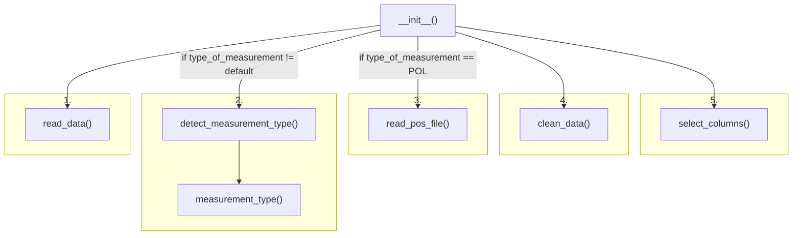
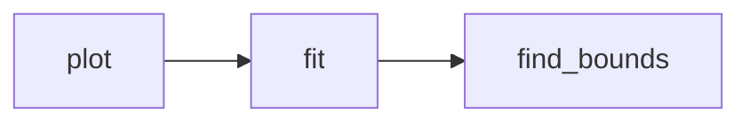

# Measurement Class

This document will keep track of the structure the measurement class has and how it functions.

- [Measurement Class](#measurement-class)
  - [Flow at Startup](#flow-at-startup)
  - [Flow when Plotting](#flow-when-plotting)
  - [Structure of a Measurement Object](#structure-of-a-measurement-object)
    - [Variables](#variables)
      - [Constants](#constants)
      - [Measurement data variables](#measurement-data-variables)
      - [Fit variables](#fit-variables)
    - [Methods](#methods)
      - [Reading files](#reading-files)
      - [Plotting data](#plotting-data)
      - [Fitting data](#fitting-data)
      - [Other](#other)

## Flow at Startup

1. read the data
2. detect measurement type
3. read position file if a position file exists
4. clean up and description gathering
5. select columns for plotting

## Flow when Plotting

## Structure of a Measurement Object

### Variables

#### Constants

Variables that won't be changed during runtime are capitalized.

| name                | description                                                        |
| ------------------- | ------------------------------------------------------------------ |
| self.N_HEADER       | number of header rows in dat file, won't be changed during runtime |
| self.FIT_RESOLUTION | number of points to be calculated and plotted of fit               |

#### Measurement data variables

| name          | description                                                                       |
| ------------- | --------------------------------------------------------------------------------- |
| self.raw      | contains the raw dat file                                                         |
| self.head     | contains the raw header of the dat file                                           |
| self.data     | contains the raw data as numpy array of floats of the dat file without the header |
| self.desc     | last line of self.head used for axis labels                                       |
| self.settings | dictionary holding useful information gathered from dat file, like timestamp      |
| self.x        | x-axis of data (not the raw data)                                                 |
| self.y        | y-axis of data (not the raw data)                                                 |
| self.y_error  | (calculated) error of y-axis                                                      |

#### Fit variables

| name                   | description                                            |
| ---------------------- | ------------------------------------------------------ |
| self.type_of_fit       | contains the name of the function to fit the data with |
| self.fit_fuction_list  | a list of all possible fit functions                   |
| self.used_fit_function | contains the last used fitting function                |

### Methods

#### Reading files

| name                           | description                                                                       | runs at \_\_init\_\_ | invokes                                      |
| ------------------------------ | --------------------------------------------------------------------------------- | -------------------- | -------------------------------------------- |
| self.measurement_type()        | sets measurement type and returns it see self.type_of_measurement                 | yes                  | none                                         |
| self.detect_measurement_type() | autodetects self.type_of_measurement                                              | yes                  | measurement_type()                           |
| self.read_data()               | import the dat file                                                               | yes                  | detect_measurement_type()                    |
| self.clean_data()              | splits data into self.head, self.data and self.desc; writes self.settings         | yes                  | degree_of_polarisation() or select_columns() |
| self.degree_of_polarisation()  | calculates degree of polarisation                                                 | sometimes            | select_columns()                             |
| self.select_columns()          | selects different columns and elements from original raw data stored in self.data | yes                  | none                                         |

#### Plotting data

| name        | description                     | runs at \_\_init\_\_ | invokes |
| ----------- | ------------------------------- | -------------------- | ------- |
| self.plot() | plots the data and writes a png | no                   | none    |

#### Fitting data

| name            | description                      | runs at \_\_init\_\_ | invokes |
| --------------- | -------------------------------- | -------------------- | ------- |
| self.fit()      | fits data                        | no                   | none    |
| self.gauss()    | Gaußian                          | no                   | none    |
| self.sine_lin() | sine wave with added linear term | no                   | none    |
| self.poly5()    | polynom of grade 5               | no                   | none    |
| self.sine()     | sine wave only                   | no                   | none    |

#### Other

| name                | description | runs at \_\_init\_\_ | invokes |
| ------------------- | ----------- | -------------------- | ------- |
| self.\_\_init\_\_() |             | yes                  | a lot   |
