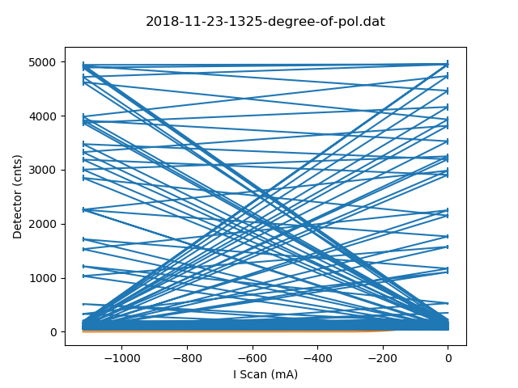

# Metadata for 2018-11-23-1325-degree-of-pol.dat

## Basic Information
Here is some basic information about the measurement, which was either provided by you, or automatically detected.

- file_path : [testfiles\2018-11-23-1325-degree-of-pol.dat](testfiles\2018-11-23-1325-degree-of-pol.dat)
- type_of_measurement : POL
- type_of_fit : gauss
- pos_file_path  : [testfiles\subdirectory_test\2018-11-23-0900-degree-of-polarisation.pos](testfiles\subdirectory_test\2018-11-23-0900-degree-of-polarisation.pos)
## Detector Information
Here is some basic information about the measurement, which was either provided by you, or automatically detected.

- timestamp : 2018-11-23 13:20:00
-  Measure Time (sec) : 100
-  Bg detector (cnts/sec) : 0.875000
-  Bg monitor (cnts/sec) : 0.000000100
-  Mon.lim.  (cnts/sec) :   0
- Ioff (cnts/sec) :  0.424997   ErrIoff
- Power Supply 1 (mA) :  scan
-  Power Supply 2 (mA) :  -528
-  Power Supply 3 (mA) :  scan
-  Power Supply 4 (mA) :  -531
-  Power Supply 5 (mA) :  OFF
-  Power Supply 6 (mA) :  OFF   
- I Scan (mA) :   Detector (cnts)
## Fit (gauss)
### Fit Parameters and Covariance
Parameters:

- a : `0.9783506167617136`
- x0 : `1622885.524708897`
- sigma : `663829.7872340403`
Covariance:
```
[[ 1.52312372e-05,  4.66170928e+00, -1.35190558e+02],
 [ 4.66170928e+00,  1.29667061e+08, -1.86860487e+08],
 [-1.35190558e+02, -1.86860487e+08,  2.81185267e+09]]
```
### Fit Boundaries

- a : `[0.4194310207814196 , 1.2582930623442588]`
- x0 : `[770000.0 , 2310000.0]`
- sigma : `[221276.59574468085 , 663829.7872340425]`
