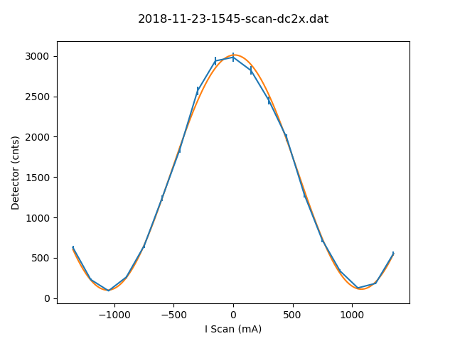

# Metadata for 2018-11-23-1545-scan-dc2x.dat

## Basic Information
Here is some basic information about the measurement, which was either provided by you, or automatically detected.

- file_path : [testfiles\2018-11-23-1545-scan-dc2x.dat](2018-11-23-1545-scan-dc2x.dat)
- type_of_measurement : DC
- type_of_fit : sine_lin
## Detector Information
Here is some basic information about the measurement, which was either provided by you, or automatically detected.

-  Bg detector (cnts/sec) : 0.875000
-  Bg monitor (cnts/sec) : 0.00000060
-  Mon.lim.  (cnts/sec) :   0
-  Power Supply 2 (mA) :  0
-  Power Supply 3 (mA) :  scan
-  Power Supply 4 (mA) :  -531
-  Power Supply 5 (mA) :  OFF
-  Power Supply 6 (mA) :  OFF   
- time_stamp : 2018-11-23 15:44:00
- measurement_time : 60
## Extreme Values

- x_min: `-1350.0`
- x_max: `1350.0`
- y_min: `91.125`
- y_max: `2984.5`

Horizontal axis values where vertical axis is max or min:

- y_min_i: `-1050.0`
- y_max_i: `0.0`

This gives a contrast of `0.940743751270067`.

## Fit (sine_lin)
### Fit Parameters, Covariance and Contrast
Parameters:

- a : `1453.654364755076`
- omega : `0.002940022157616908`
- phase : `350936.287551555`
- c : `1559.048667252186`
- b : `0.005192059326326062`

Covariance:
```
[[ 1.36331195e+02, 
 1.62669203e-05, 
 1.61304322e-03, 
 1.07329070e+02,
  -1.57181004e-03],
 [ 1.62669203e-05, 
 5.76994271e-11, 
 5.47820391e-10, 
 1.19008719e-05,
  -3.75003678e-10],
 [ 1.61304322e-03, 
 5.47820391e-10, 
 4.83070307e-05, 
 8.50053380e-04,
  -7.58798613e-07],
 [ 1.07329070e+02, 
 1.19008719e-05, 
 8.50053380e-04, 
 1.06182247e+02,
  -1.16352200e-04],
 [-1.57181004e-03, 
-3.75003678e-10, 
-7.58798613e-07, 
-1.16352200e-04,
   2.04282784e-05]]
```

Contrast: `0.9358090416366872`
### Fit Boundaries

- a : `[723.34375 , 2170.03125]`
- omega : `[0.0014959965017094254 , 0.004487989505128276]`
- phase : `[175469.110156978 , 526407.3304709339]`
- c : `[768.90625 , 2306.71875]`
- b : `[-1.377797619047619 , 1.377797619047619]`
