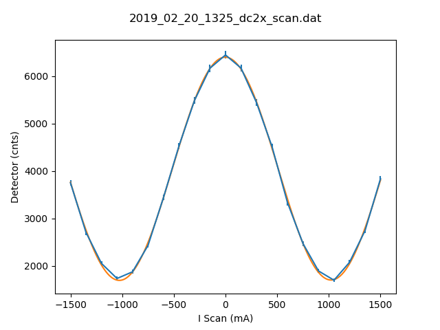

# Metadata for 2019_02_20_1325_dc2x_scan.dat

## Basic Information
Here is some basic information about the measurement, which was either provided by you, or automatically detected.

- file_path : [testfiles\2019_02_20_1325_dc2x_scan.dat](testfiles\2019_02_20_1325_dc2x_scan.dat)
- type_of_measurement : DC
- type_of_fit : sine_lin
- pos_file_path  : [None](None)
## Detector Information
Here is some basic information about the measurement, which was either provided by you, or automatically detected.

- timestamp : 2019-02-20 13:07:00
-  Measure Time (sec) : 180
-  Bg detector (cnts/sec) : 0.330000
-  Bg monitor (cnts/sec) : 0.000000180
-  Mon.lim.  (cnts/sec) :   0
- Ioff (cnts/sec) :  0.096569   ErrIoff
- Power Supply 1 (mA) :  0
-  Power Supply 2 (mA) :  0
-  Power Supply 3 (mA) :  scan
-  Power Supply 4 (mA) :  0
-  Power Supply 5 (mA) :  OFF
-  Power Supply 6 (mA) :  OFF   
- I Scan (mA) :   Detector (cnts)
## Fit (sine_lin)
### Fit Parameters and Covariance
Parameters:

- a : `2353.1949004907483`
- omega : `0.003066608654417374`
- phase : `350936.3277452573`
- c : `4048.039282314018`
- b : `0.003611658098235018`
Covariance:
```
[[ 4.21612076e+02,  7.41386322e-06,  4.37010024e-04,  1.97678497e+02,
  -4.48799282e-04],
 [ 7.41386322e-06,  5.88951202e-11,  1.39671029e-10, -1.30178667e-05,
  -3.31442671e-10],
 [ 4.37010024e-04,  1.39671029e-10,  5.88387312e-05, -2.48362957e-04,
  -1.71973198e-05],
 [ 1.97678497e+02, -1.30178667e-05, -2.48362957e-04,  2.36987189e+02,
   2.49796861e-04],
 [-4.48799282e-04, -3.31442671e-10, -1.71973198e-05,  2.49796861e-04,
   1.50480552e-04]]
```
### Fit Boundaries

- a : `[1188.25 , 3564.75]`
- omega : `[0.0014959965017094254 , 0.004487989505128276]`
- phase : `[175469.110156978 , 526407.3304709339]`
- c : `[2035.65 , 6106.950000000001]`
- b : `[-2.263333333333333 , 2.263333333333333]`
