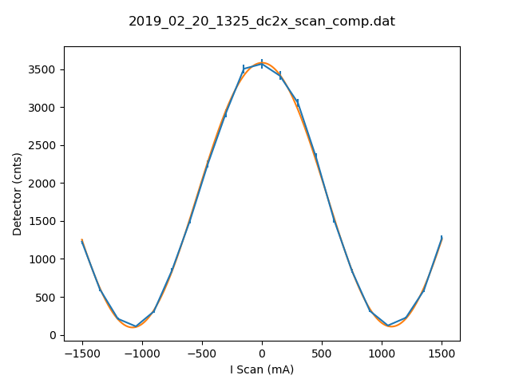

# Metadata for 2019_02_20_1325_dc2x_scan_comp.dat

## Basic Information
Here is some basic information about the measurement, which was either provided by you, or automatically detected.

- file_path : [testfiles\2019_02_20_1325_dc2x_scan_comp.dat](testfiles\2019_02_20_1325_dc2x_scan_comp.dat)
- type_of_measurement : DC
- type_of_fit : sine_lin
- pos_file_path  : [None](None)
## Detector Information
Here is some basic information about the measurement, which was either provided by you, or automatically detected.

- timestamp : 2019-02-20 14:16:00
-  Measure Time (sec) : 100
-  Bg detector (cnts/sec) : 0.330000
-  Bg monitor (cnts/sec) : 0.000000100
-  Mon.lim.  (cnts/sec) :   0
- Ioff (cnts/sec) :  0.096569   ErrIoff
- Power Supply 1 (mA) :  0
-  Power Supply 2 (mA) :  0
-  Power Supply 3 (mA) :  scan
-  Power Supply 4 (mA) :  0
-  Power Supply 5 (mA) :  OFF
-  Power Supply 6 (mA) :  OFF   
- I Scan (mA) :   Detector (cnts)
## Fit (sine_lin)
### Fit Parameters and Covariance
Parameters:

- a : `1740.3064180332572`
- omega : `0.0029121168164827826`
- phase : `350936.31629211106`
- c : `1842.8796044872497`
- b : `0.005268491615371984`
Covariance:
```
[[ 1.46711773e+02,  1.68564313e-06,  1.61931414e-04,  1.14770929e+02,
  -6.27786526e-04],
 [ 1.68564313e-06,  3.07630964e-11,  2.80660753e-10, -1.25185085e-06,
   1.20001236e-10],
 [ 1.61931414e-04,  2.80660753e-10,  3.29855244e-05,  3.11880537e-05,
  -2.46054510e-06],
 [ 1.14770929e+02, -1.25185085e-06,  3.11880537e-05,  1.12845833e+02,
   1.06890767e-04],
 [-6.27786526e-04,  1.20001236e-10, -2.46054510e-06,  1.06890767e-04,
   2.05638629e-05]]
```
### Fit Boundaries

- a : `[864.21 , 2592.63]`
- omega : `[0.0014959965017094254 , 0.004487989505128276]`
- phase : `[175469.110156978 , 526407.3304709339]`
- c : `[919.7900000000001 , 2759.3700000000003]`
- b : `[-1.6461142857142859 , 1.6461142857142859]`
