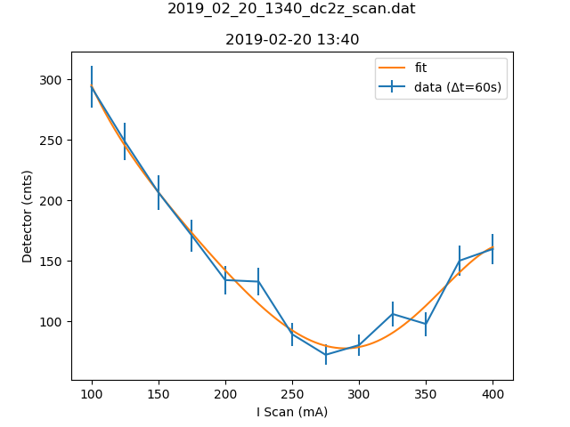

# Metadata for 2019_02_20_1340_dc2z_scan.dat

## Basic Information
Here is some basic information about the measurement, which was either provided by you, or automatically detected.

- file_path : [testfiles\2019_02_20_1340_dc2z_scan.dat](2019_02_20_1340_dc2z_scan.dat)
- type_of_measurement : DC
- type_of_fit : poly5
## Detector Information
Here is some basic information about the measurement, which was either provided by you, or automatically detected.

-  Bg detector (cnts/sec) : 0.330000
-  Bg monitor (cnts/sec) : 0.00000060
-  Mon.lim.  (cnts/sec) :   0
-  Power Supply 2 (mA) :  0
-  Power Supply 3 (mA) :  1018
-  Power Supply 4 (mA) :  0
-  Power Supply 5 (mA) :  OFF
-  Power Supply 6 (mA) :  OFF   
- time_stamp : 2019-02-20 13:40:00
- measurement_time : 60
## Extreme Values

- x_min: `100.0`
- x_max: `400.0`
- y_min: `72.36`
- y_max: `293.6`

Horizontal axis values where vertical axis is max or min:

- y_min_i: `275.0`
- y_max_i: `100.0`

This gives a contrast of `0.6045469450213138`.

## Fit (poly5)
### Fit Parameters, Covariance and Contrast
Parameters:

- a5 : `-1.0054528249039e-09`
- a4 : `1.2004995990915036e-06`
- a3 : `-0.0005375526713042932`
- a2 : `0.11737373646564694`
- a1 : `-14.002603690041292`
- a0 : `949.0590493331873`

Covariance:
```
[[ 8.71149042e-19, 
-1.10309612e-15, 
 5.35268168e-13, 
-1.23586937e-10,
   1.34727632e-08, 
-5.50277641e-07],
 [-1.10309612e-15, 
 1.40171500e-12, 
-6.82770664e-10, 
 1.58287558e-07,
  -1.73288552e-05, 
 7.10723464e-04],
 [ 5.35268168e-13, 
-6.82770664e-10, 
 3.33977348e-07, 
-7.77813446e-05,
   8.55662650e-03, 
-3.52649163e-01],
 [-1.23586937e-10, 
 1.58287558e-07, 
-7.77813446e-05, 
 1.82070368e-02,
  -2.01400503e+00, 
 8.34775020e+01],
 [ 1.34727632e-08, 
-1.73288552e-05, 
 8.55662650e-03, 
-2.01400503e+00,
   2.24162480e+02, 
-9.35292648e+03],
 [-5.50277641e-07, 
 7.10723464e-04, 
-3.52649163e-01, 
 8.34775020e+01,
  -9.35292648e+03, 
 3.93196621e+05]]
```

Contrast: `0.5831566374743183`
### Fit Boundaries

No information about the boundaries could be presented, because the following exception occured:
zip argument #2 must support iteration

Please report this error by opening a new ticket in Bitbucket. Most likely, the function that should detect the boundaries was not defined yet.
