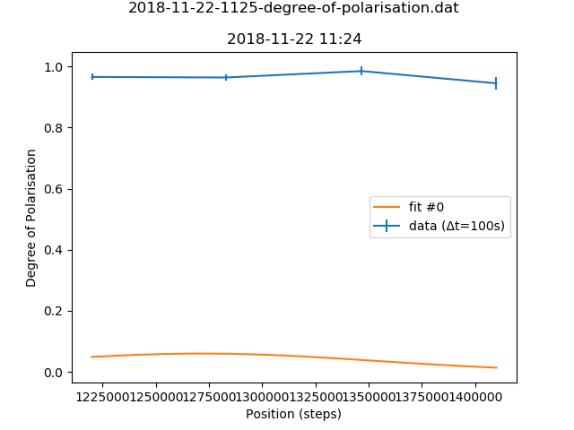

b'# Metadata for 2018-11-22-1125-degree-of-polarisation.dat'
b''
b''
b'## Basic Information'
b'Here is some basic information about the measurement, which was either provided by you, or automatically detected.'
b''
b'- file_path : [C:\\Users\\Nico Einsidler\\Documents\\pigor\\testfiles\\polarimeter\\2018-11-22-1125-degree-of-polarisation.dat](2018-11-22-1125-degree-of-polarisation.dat)'
b'- type_of_measurement : POL'
b'- type_of_fit : gauss'
b'- pos_file_path : [testfiles\\polarimeter\\2018-11-23-0900-degree-of-polarisation.pos](2018-11-23-0900-degree-of-polarisation.pos)'
b''
b'## Detector Information'
b'Here is some basic information about the measurement, which was either provided by you, or automatically detected.'
b''
b'-  Bg detector (cnts/sec) : 0.875000'
b'-  Bg monitor (cnts/sec) : 0.000000100'
b'-  Mon.lim.  (cnts/sec) :   0'
b'-  Power Supply 2 (mA) :  -528'
b'-  Power Supply 3 (mA) :  scan'
b'-  Power Supply 4 (mA) :  -531'
b'-  Power Supply 5 (mA) :  OFF'
b'-  Power Supply 6 (mA) :  OFF   '
b'- time_stamp : 2018-11-22 11:24:00'
b'- measurement_time : 100'
b''
b'## Extreme Values'
b''
b'- x_min: `1220000.0`'
b'- x_max: `1410000.0`'
b'- y_min: `[0.9446491542126226]`'
b'- y_max: `[0.9846783516120697]`'
b''
b'Horizontal axis values where vertical axis is max or min:'
b''
b'- y_min_i: `[1410000.0]`'
b'- y_max_i: `[1346700.0]`'
b''
b'This gives a contrast of `[-0.020747746185444338]`.'
b''
b'## Fit (gauss)'
b''
b'### Fit Parameters, Covariance and Contrast'
b''
b'Parameters:'
b''
b'- Fit #0 a : `0.06004379609917065`'
b'- Fit #0 x0 : `1271717.3093199204`'
b'- Fit #0 sigma : `80808.41312782708`'
b''
b'Covariance:'
b"```\n['[[ 1.16085300e-04, \\n 5.77137952e+01, \\n-2.16962218e+02],\\n [ 5.77137952e+01, \\n 4.12751318e+08, \\n-1.73399102e+08],\\n [-2.16962218e+02, \\n-1.73399102e+08, \\n 9.14645045e+08]]']\n```"
b''
b'Contrast for fit #0: `-0.6243402852906156`'
b''
b'### Fit Boundaries'
b''
b'- a : `[0.02001459869972355 , 0.060043796099170654]`'
b'- x0 : `[673350.0 , 2020050.0]`'
b'- sigma : `[26936.170212765956 , 80808.51063829787]`'
