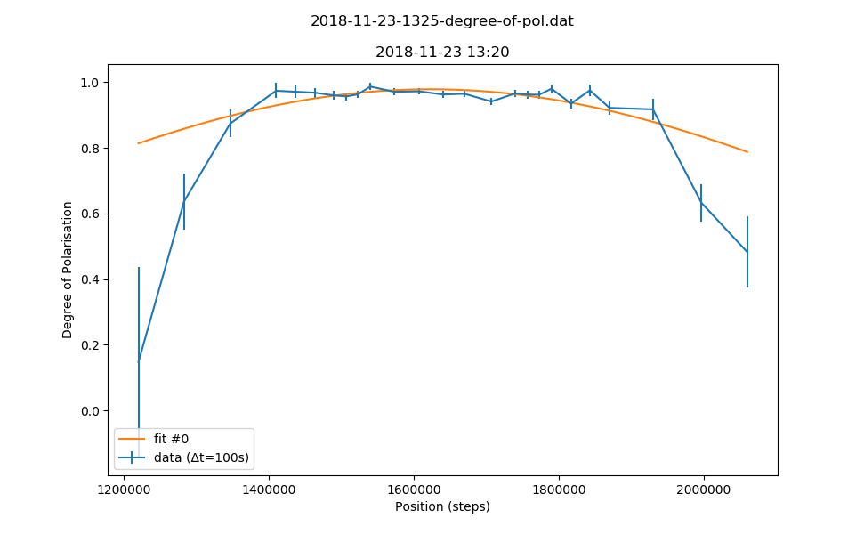

b'# Metadata for 2018-11-23-1325-degree-of-pol.dat'
b''
b''
b'## Basic Information'
b'Here is some basic information about the measurement, which was either provided by you, or automatically detected.'
b''
b'- file_path : [C:\\Users\\Nico Einsidler\\Documents\\pigor\\testfiles\\polarimeter\\2018-11-23-1325-degree-of-pol.dat](2018-11-23-1325-degree-of-pol.dat)'
b'- type_of_measurement : POL'
b'- type_of_fit : gauss'
b'- pos_file_path : [testfiles\\polarimeter\\2018-11-23-0900-degree-of-polarisation.pos](2018-11-23-0900-degree-of-polarisation.pos)'
b''
b'## Detector Information'
b'Here is some basic information about the measurement, which was either provided by you, or automatically detected.'
b''
b'-  Bg detector (cnts/sec) : 0.875000'
b'-  Bg monitor (cnts/sec) : 0.000000100'
b'-  Mon.lim.  (cnts/sec) :   0'
b'-  Power Supply 2 (mA) :  -528'
b'-  Power Supply 3 (mA) :  scan'
b'-  Power Supply 4 (mA) :  -531'
b'-  Power Supply 5 (mA) :  OFF'
b'-  Power Supply 6 (mA) :  OFF   '
b'- time_stamp : 2018-11-23 13:20:00'
b'- measurement_time : 100'
b''
b'## Extreme Values'
b''
b'- x_min: `1220000.0`'
b'- x_max: `2060000.0`'
b'- y_min: `[0.14774888355384544]`'
b'- y_max: `[0.9866109251166846]`'
b''
b'Horizontal axis values where vertical axis is max or min:'
b''
b'- y_min_i: `[1220000.0]`'
b'- y_max_i: `[1540000.0]`'
b''
b'This gives a contrast of `[-0.7395026120909429]`.'
b''
b'## Fit (gauss)'
b''
b'### Fit Parameters, Covariance and Contrast'
b''
b'Parameters:'
b''
b'- Fit #0 a : `0.9783506167617136`'
b'- Fit #0 x0 : `1622885.524708897`'
b'- Fit #0 sigma : `663829.7872340403`'
b''
b'Covariance:'
b"```\n['[[ 1.52312372e-05, \\n 4.66170928e+00, \\n-1.35190558e+02],\\n [ 4.66170928e+00, \\n 1.29667061e+08, \\n-1.86860487e+08],\\n [-1.35190558e+02, \\n-1.86860487e+08, \\n 2.81185267e+09]]']\n```"
b''
b'Contrast for fit #0: `-0.10797434301501299`'
b''
b'### Fit Boundaries'
b''
b'- a : `[0.4194310207814196 , 1.2582930623442588]`'
b'- x0 : `[770000.0 , 2310000.0]`'
b'- sigma : `[221276.59574468085 , 663829.7872340425]`'
