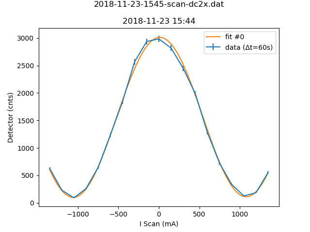

b'# Metadata for 2018-11-23-1545-scan-dc2x.dat'
b''
b''
b'## Basic Information'
b'Here is some basic information about the measurement, which was either provided by you, or automatically detected.'
b''
b'- file_path : [C:\\Users\\Nico Einsidler\\Documents\\pigor\\testfiles\\polarimeter\\2018-11-23-1545-scan-dc2x.dat](2018-11-23-1545-scan-dc2x.dat)'
b'- type_of_measurement : DC'
b'- type_of_fit : sine_lin'
b''
b'## Detector Information'
b'Here is some basic information about the measurement, which was either provided by you, or automatically detected.'
b''
b'-  Bg detector (cnts/sec) : 0.875000'
b'-  Bg monitor (cnts/sec) : 0.00000060'
b'-  Mon.lim.  (cnts/sec) :   0'
b'-  Power Supply 2 (mA) :  0'
b'-  Power Supply 3 (mA) :  scan'
b'-  Power Supply 4 (mA) :  -531'
b'-  Power Supply 5 (mA) :  OFF'
b'-  Power Supply 6 (mA) :  OFF   '
b'- time_stamp : 2018-11-23 15:44:00'
b'- measurement_time : 60'
b''
b'## Extreme Values'
b''
b'- x_min: `-1350.0`'
b'- x_max: `1350.0`'
b'- y_min: `[91.125]`'
b'- y_max: `[2984.5]`'
b''
b'Horizontal axis values where vertical axis is max or min:'
b''
b'- y_min_i: `[-1050.0]`'
b'- y_max_i: `[0.0]`'
b''
b'This gives a contrast of `[-0.940743751270067]`.'
b''
b'## Fit (sine_lin)'
b''
b'### Fit Parameters, Covariance and Contrast'
b''
b'Parameters:'
b''
b'- Fit #0 a : `1453.6543646682946`'
b'- Fit #0 omega : `0.002940022157606464`'
b'- Fit #0 phase : `88.15469356003808\xc2\xb0`'
b'- Fit #0 c : `1559.0486671786923`'
b'- Fit #0 b : `0.005192059324736649`'
b''
b'Covariance:'
b"```\n['[[ 1.36319632e+02, \\n 1.62648380e-05, \\n 1.42943072e-03, \\n 1.07325840e+02,\\n  -1.56892606e-03],\\n [ 1.62648380e-05, \\n 5.76994271e-11, \\n 5.47817823e-10, \\n 1.19008717e-05,\\n  -3.75003693e-10],\\n [ 1.42943072e-03, \\n 5.47817823e-10, \\n 4.83065907e-05, \\n 8.50049616e-04,\\n  -7.58795305e-07],\\n [ 1.07325840e+02, \\n 1.19008717e-05, \\n 8.50049616e-04, \\n 1.06182248e+02,\\n  -1.16352263e-04],\\n [-1.56892606e-03, \\n-3.75003693e-10, \\n-7.58795305e-07, \\n-1.16352263e-04,\\n   2.04282784e-05]]']\n```"
b''
b'Contrast for fit #0: `-0.9358090416242607`'
b''
b'### Fit Boundaries'
b''
b'- a : `[723.34375 , 2170.03125]`'
b'- omega : `[0.0014959965017094254 , 0.004487989505128276]`'
b'- phase : `[0.9502778638746783 , 2.850833591624035]`'
b'- c : `[768.90625 , 2306.71875]`'
b'- b : `[-1.377797619047619 , 1.377797619047619]`'
