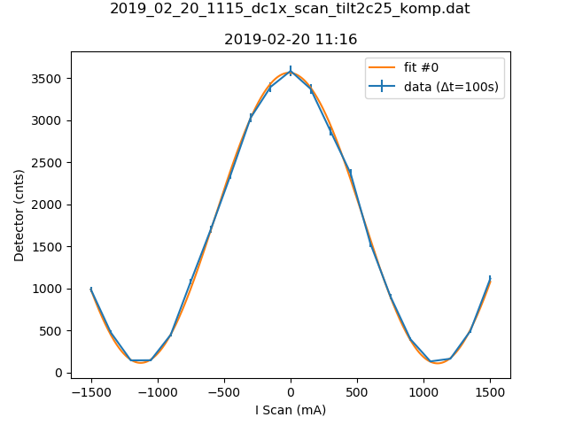

# Metadata for 2019_02_20_1115_dc1x_scan_tilt2c25_komp.dat


## Basic Information
Here is some basic information about the measurement, which was either provided by you, or automatically detected.

- file_path : [C:\Users\Nico Einsidler\Documents\pigor\testfiles\polarimeter\2019_02_20_1115_dc1x_scan_tilt2c25_komp.dat](2019_02_20_1115_dc1x_scan_tilt2c25_komp.dat)
- type_of_measurement : DC
- type_of_fit : sine_lin

## Detector Information
Here is some basic information about the measurement, which was either provided by you, or automatically detected.

-  Bg detector (cnts/sec) : 0.330000
-  Bg monitor (cnts/sec) : 0.000000100
-  Mon.lim.  (cnts/sec) :   0
-  Power Supply 2 (mA) :  0
-  Power Supply 3 (mA) :  0
-  Power Supply 4 (mA) :  0
-  Power Supply 5 (mA) :  OFF
-  Power Supply 6 (mA) :  OFF   
- time_stamp : 2019-02-20 11:16:00
- measurement_time : 100

## Extreme Values

- x_min: `-1500.0`
- x_max: `1500.0`
- y_min: `[130.96]`
- y_max: `[3587.0]`

Horizontal axis values where vertical axis is max or min:

- y_min_i: `[1050.0]`
- y_max_i: `[0.0]`

This gives a contrast of `[0.9295527654950564]`.

## Fit (sine_lin)

### Fit Parameters, Covariance and Contrast

Parameters:

- Fit #0 a : `1727.4821238718066`
- Fit #0 omega : `0.00281803808777158`
- Fit #0 phase : `91.8457764831802°`
- Fit #0 c : `1837.536643444123`
- Fit #0 b : `-0.00261531814856409`

Covariance:
```
['[[ 1.45492124e+02, \n 6.21776764e-06, \n-2.57748940e-04, \n 1.14259811e+02,\n  -3.64740808e-04],\n [ 6.21776764e-06, \n 3.23850699e-11, \n-4.64402472e-10, \n 2.50093479e-06,\n  -4.90741367e-10],\n [-2.57748940e-04, \n-4.64402472e-10, \n 3.45235228e-05, \n-4.92375021e-04,\n  -2.14983828e-06],\n [ 1.14259811e+02, \n 2.50093479e-06, \n-4.92375021e-04, \n 1.12551310e+02,\n  -1.95296092e-04],\n [-3.64740808e-04, \n-4.90741367e-10, \n-2.14983828e-06, \n-1.95296092e-04,\n   1.91934398e-05]]']
```

Contrast for fit #0: `0.9416325737297879`

### Fit Boundaries

- a : `[864.01 , 2592.0299999999997]`
- omega : `[0.0014959965017094254 , 0.004487989505128276]`
- phase : `[0.9502778638746783 , 2.850833591624035]`
- c : `[929.49 , 2788.4700000000003]`
- b : `[-1.6457333333333333 , 1.6457333333333333]`
