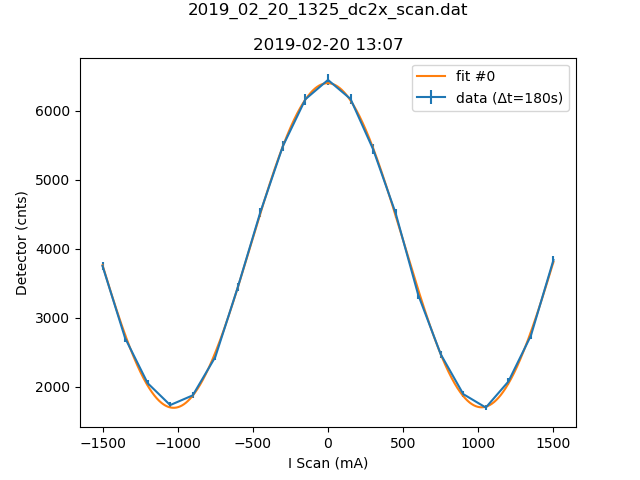

b'# Metadata for 2019_02_20_1325_dc2x_scan.dat'
b''
b''
b'## Basic Information'
b'Here is some basic information about the measurement, which was either provided by you, or automatically detected.'
b''
b'- file_path : [C:\\Users\\Nico Einsidler\\Documents\\pigor\\testfiles\\polarimeter\\2019_02_20_1325_dc2x_scan.dat](2019_02_20_1325_dc2x_scan.dat)'
b'- type_of_measurement : DC'
b'- type_of_fit : sine_lin'
b''
b'## Detector Information'
b'Here is some basic information about the measurement, which was either provided by you, or automatically detected.'
b''
b'-  Bg detector (cnts/sec) : 0.330000'
b'-  Bg monitor (cnts/sec) : 0.000000180'
b'-  Mon.lim.  (cnts/sec) :   0'
b'-  Power Supply 2 (mA) :  0'
b'-  Power Supply 3 (mA) :  scan'
b'-  Power Supply 4 (mA) :  0'
b'-  Power Supply 5 (mA) :  OFF'
b'-  Power Supply 6 (mA) :  OFF   '
b'- time_stamp : 2019-02-20 13:07:00'
b'- measurement_time : 180'
b''
b'## Extreme Values'
b''
b'- x_min: `-1500.0`'
b'- x_max: `1500.0`'
b'- y_min: `[1694.8]`'
b'- y_max: `[6447.8]`'
b''
b'Horizontal axis values where vertical axis is max or min:'
b''
b'- y_min_i: `[1050.0]`'
b'- y_max_i: `[0.0]`'
b''
b'This gives a contrast of `[-0.5837201876550487]`.'
b''
b'## Fit (sine_lin)'
b''
b'### Fit Parameters, Covariance and Contrast'
b''
b'Parameters:'
b''
b'- Fit #0 a : `2353.1948599034636`'
b'- Fit #0 omega : `0.003066608638561942`'
b'- Fit #0 phase : `90.45762251874004\xc2\xb0`'
b'- Fit #0 c : `4048.039323311901`'
b'- Fit #0 b : `0.0036116600065445`'
b''
b'Covariance:'
b"```\n['[[ 4.21608917e+02, \\n 7.41300494e-06, \\n 7.49880891e-05, \\n 1.97680021e+02,\\n  -3.42987230e-04],\\n [ 7.41300494e-06, \\n 5.88951228e-11, \\n 1.39670454e-10, \\n-1.30178654e-05,\\n  -3.31441830e-10],\\n [ 7.49880891e-05, \\n 1.39670454e-10, \\n 5.88381968e-05, \\n-2.48360116e-04,\\n  -1.71972403e-05],\\n [ 1.97680021e+02, \\n-1.30178654e-05, \\n-2.48360116e-04, \\n 2.36987186e+02,\\n   2.49796346e-04],\\n [-3.42987230e-04, \\n-3.31441830e-10, \\n-1.71972403e-05, \\n 2.49796346e-04,\\n   1.50480551e-04]]']\n```"
b''
b'Contrast for fit #0: `-0.5820415996985367`'
b''
b'### Fit Boundaries'
b''
b'- a : `[1188.25 , 3564.75]`'
b'- omega : `[0.0014959965017094254 , 0.004487989505128276]`'
b'- phase : `[0.9502778638746783 , 2.850833591624035]`'
b'- c : `[2035.65 , 6106.950000000001]`'
b'- b : `[-2.263333333333333 , 2.263333333333333]`'
