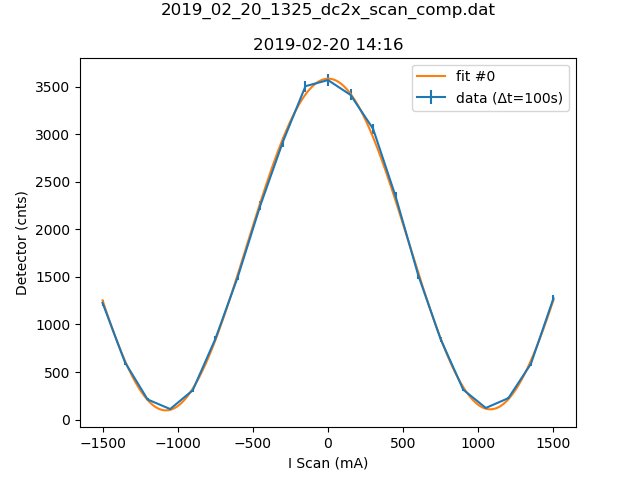

b'# Metadata for 2019_02_20_1325_dc2x_scan_comp.dat'
b''
b''
b'## Basic Information'
b'Here is some basic information about the measurement, which was either provided by you, or automatically detected.'
b''
b'- file_path : [C:\\Users\\Nico Einsidler\\Documents\\pigor\\testfiles\\polarimeter\\2019_02_20_1325_dc2x_scan_comp.dat](2019_02_20_1325_dc2x_scan_comp.dat)'
b'- type_of_measurement : DC'
b'- type_of_fit : sine_lin'
b''
b'## Detector Information'
b'Here is some basic information about the measurement, which was either provided by you, or automatically detected.'
b''
b'-  Bg detector (cnts/sec) : 0.330000'
b'-  Bg monitor (cnts/sec) : 0.000000100'
b'-  Mon.lim.  (cnts/sec) :   0'
b'-  Power Supply 2 (mA) :  0'
b'-  Power Supply 3 (mA) :  scan'
b'-  Power Supply 4 (mA) :  0'
b'-  Power Supply 5 (mA) :  OFF'
b'-  Power Supply 6 (mA) :  OFF   '
b'- time_stamp : 2019-02-20 14:16:00'
b'- measurement_time : 100'
b''
b'## Extreme Values'
b''
b'- x_min: `-1500.0`'
b'- x_max: `1500.0`'
b'- y_min: `[111.16]`'
b'- y_max: `[3568.0]`'
b''
b'Horizontal axis values where vertical axis is max or min:'
b''
b'- y_min_i: `[-1050.0]`'
b'- y_max_i: `[0.0]`'
b''
b'This gives a contrast of `[-0.9395731634394808]`.'
b''
b'## Fit (sine_lin)'
b''
b'### Fit Parameters, Covariance and Contrast'
b''
b'Parameters:'
b''
b'- Fit #0 a : `1740.306417344683`'
b'- Fit #0 omega : `0.0029121168167054036`'
b'- Fit #0 phase : `89.80140600106421\xc2\xb0`'
b'- Fit #0 c : `1842.8796064419207`'
b'- Fit #0 b : `0.005268491752749212`'
b''
b'Covariance:'
b"```\n['[[ 1.46710981e+02, \\n 1.68436615e-06, \\n 1.18368074e-05, \\n 1.14770787e+02,\\n  -6.16590508e-04],\\n [ 1.68436615e-06, \\n 3.07630965e-11, \\n 2.80659708e-10, \\n-1.25185077e-06,\\n   1.20001307e-10],\\n [ 1.18368074e-05, \\n 2.80659708e-10, \\n 3.29852242e-05, \\n 3.11879210e-05,\\n  -2.46053385e-06],\\n [ 1.14770787e+02, \\n-1.25185077e-06, \\n 3.11879210e-05, \\n 1.12845833e+02,\\n   1.06890571e-04],\\n [-6.16590508e-04, \\n 1.20001307e-10, \\n-2.46053385e-06, \\n 1.06890571e-04,\\n   2.05638629e-05]]']\n```"
b''
b'Contrast for fit #0: `-0.9473405486649328`'
b''
b'### Fit Boundaries'
b''
b'- a : `[864.21 , 2592.63]`'
b'- omega : `[0.0014959965017094254 , 0.004487989505128276]`'
b'- phase : `[0.9502778638746783 , 2.850833591624035]`'
b'- c : `[919.7900000000001 , 2759.3700000000003]`'
b'- b : `[-1.6461142857142859 , 1.6461142857142859]`'
