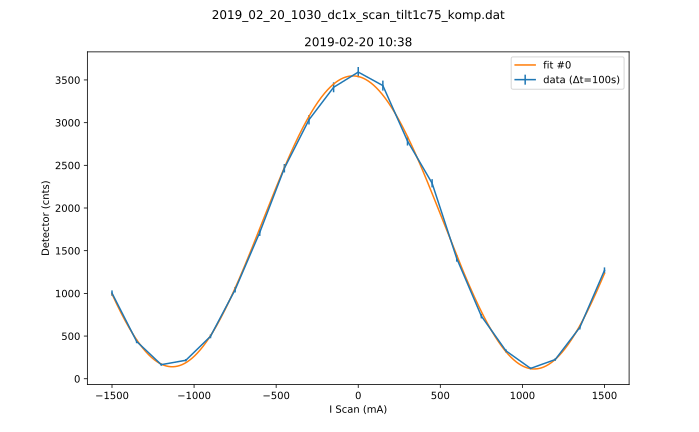

# Metadata for 2019_02_20_1030_dc1x_scan_tilt1c75_komp.dat


## Basic Information
Here is some basic information about the measurement, which was either provided by you, or automatically detected.

- file_path : [C:\Users\Nico Einsidler\Documents\pigor\testfiles\polarimeter\b\2019_02_20_1030_dc1x_scan_tilt1c75_komp.dat](2019_02_20_1030_dc1x_scan_tilt1c75_komp.dat)
- type_of_measurement : DC
- type_of_fit : sine_lin

## Detector Information
Here is some basic information about the measurement, which was either provided by you, or automatically detected.

-  Bg detector (cnts/sec) : 0.330000
-  Bg monitor (cnts/sec) : 0.000000100
-  Mon.lim.  (cnts/sec) :   0
-  Power Supply 2 (mA) :  0
-  Power Supply 3 (mA) :  0
-  Power Supply 4 (mA) :  0
-  Power Supply 5 (mA) :  OFF
-  Power Supply 6 (mA) :  OFF   
- time_stamp : 2019-02-20 10:38:00
- measurement_time : 100

## Extreme Values

- x_min: `-1500.0`
- x_max: `1500.0`
- y_min: `[121.24]`
- y_max: `[3592.0]`

Horizontal axis values where vertical axis is max or min:

- y_min_i: `[1050.0]`
- y_max_i: `[0.0]`

This gives a contrast of `[0.9346985382038329]`.

## Fit (sine_lin)

### Fit Parameters, Covariance and Contrast

Parameters:

- Fit #0 a : `1710.032053125932`
- Fit #0 omega : `0.0028491028172651623`
- Fit #0 phase : `95.11121392531648°`
- Fit #0 c : `1837.1558290621722`
- Fit #0 b : `-0.011752828136874952`

Covariance:
```
['[[ 1.49289676e+02, \n 6.12559279e-06, \n-2.42544813e-03, \n 1.14093361e+02,\n   1.12136994e-03],\n [ 6.12559279e-06, \n 3.37604013e-11, \n-1.19044098e-09, \n 1.56296434e-06,\n  -2.85811480e-10],\n [-2.42544813e-03, \n-1.19044098e-09, \n 3.57048619e-05, \n-1.72607495e-03,\n  -2.88359651e-06],\n [ 1.14093361e+02, \n 1.56296434e-06, \n-1.72607495e-03, \n 1.12424635e+02,\n  -2.20605964e-04],\n [ 1.12136994e-03, \n-2.85811480e-10, \n-2.88359651e-06, \n-2.20605964e-04,\n   2.17273212e-05]]']
```

Contrast for fit #0: `0.9374523705863499`

### Fit Boundaries

- a : `[867.69 , 2603.07]`
- omega : `[0.0014959965017094254 , 0.004487989505128276]`
- phase : `[0.9502778638746783 , 2.850833591624035]`
- c : `[928.3100000000001 , 2784.9300000000003]`
- b : `[-1.6527428571428573 , 1.6527428571428573]`
