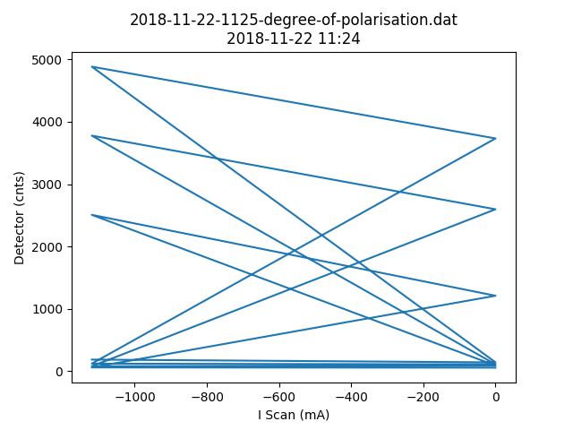

# Metadata for 2018-11-22-1125-degree-of-polarisation.dat

## Basic Information
Here is some basic information about the measurement, which was either provided by you, or automatically detected.

- file_path : [testfiles\subdirectory_test\2018-11-22-1125-degree-of-polarisation.dat](2018-11-22-1125-degree-of-polarisation.dat)
- type_of_measurement : POL
- type_of_fit : gauss
- pos_file_path : [testfiles\subdirectory_test\2018-11-23-0900-degree-of-polarisation.pos](2018-11-23-0900-degree-of-polarisation.pos)
## Detector Information
Here is some basic information about the measurement, which was either provided by you, or automatically detected.

-  Bg detector (cnts/sec) : 0.875000
-  Bg monitor (cnts/sec) : 0.000000100
-  Mon.lim.  (cnts/sec) :   0
-  Power Supply 2 (mA) :  -528
-  Power Supply 3 (mA) :  scan
-  Power Supply 4 (mA) :  -531
-  Power Supply 5 (mA) :  OFF
-  Power Supply 6 (mA) :  OFF   
- time_stamp : 2018-11-22 11:24:00
- measurement_time : 100
## Extreme Values

- x_min: `1220000.0`
- x_max: `1410000.0`
- y_min: `0.9446491542126226`
- y_max: `0.9846783516120697`

Horizontal axis values where vertical axis is max or min:

- y_min_i: `1410000.0`
- y_max_i: `1346700.0`

This gives a contrast of `0.020747746185444338`.

## Fit (gauss)
### Fit Parameters, Covariance and Contrast
Parameters:

- a : `0.06004379609917065`
- x0 : `1271717.3093199204`
- sigma : `80808.41312782708`

Covariance:
```
[[ 1.16085300e-04, 
 5.77137952e+01, 
-2.16962218e+02],
 [ 5.77137952e+01, 
 4.12751318e+08, 
-1.73399102e+08],
 [-2.16962218e+02, 
-1.73399102e+08, 
 9.14645045e+08]]
```

Contrast: `0.6243402852906156`
### Fit Boundaries

- a : `[0.02001459869972355 , 0.060043796099170654]`
- x0 : `[673350.0 , 2020050.0]`
- sigma : `[26936.170212765956 , 80808.51063829787]`
